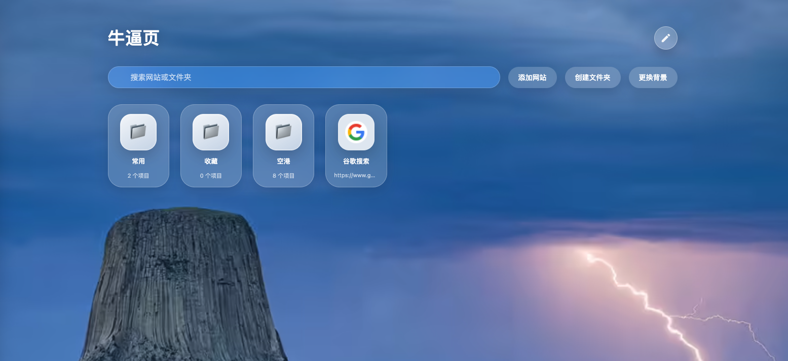
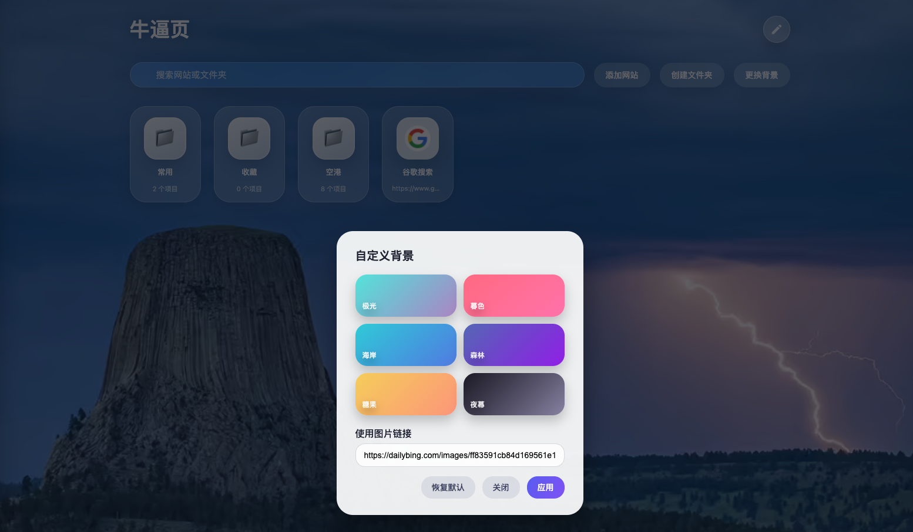

<a id="readme-top"></a>
<!-- PROJECT SHIELDS -->
[![Contributors][contributors-shield]][contributors-url]
[![Forks][forks-shield]][forks-url]
[![Stargazers][stars-shield]][stars-url]
[![Issues][issues-shield]][issues-url]
[![License][license-shield]][license-url]

<!-- PROJECT LOGO -->
<br />
<div align="center">

[//]: # (  <a href="#">)

[//]: # (    )

[//]: # (  </a>)

<h3 align="center">Web Shelf</h3>

  <p align="center">
    一款带好看的玻璃拟态界面的单页书签管理器
    <br />
    让你的浏览器起始页更有质感, 轻松管理常用网站
  </p>
</div>
Web Shelf 是一款好看的玻璃拟态界面的单页书签管理器。它运行在浏览器端，支持网站与文件夹的增删改查、自定义背景、多设备一致的拖拽交互以及 `localStorage` 持久化。在 README 中列出了核心功能、开发体验、截图预览与贡献指引，帮助你快速上手并定制属于自己的浏览器起始页。



## ✨ 功能亮点

- **iOS 风格桌面体验**：玻璃拟态卡片、圆角按钮、全局渐变背景，随手打造质感标签页。
- **灵活的收藏体系**：支持创建文件夹、拖拽排序、文件夹内外互相移动，搜索跨层级生效。
- **个性化背景**：内置渐变主题，可自定义图片链接并即时预览；背景和数据均存储于 `localStorage`。
- **零依赖单文件**：所有 HTML/CSS/JS 均在 `index.html` 内，直接 `open index.html` 即可使用。

## 🛠️ 开发与调试

```bash
# 启动简单的静态服务器（可选）
python3 -m http.server 8080

# 或直接打开文件
open index.html  # macOS
```

主要逻辑位于 `index.html`：

- **UI / 交互**：使用原生 DOM API 实现搜索、拖拽、模态框等交互。
- **数据持久化**：书签、文件夹、背景信息分别存储至 `localStorage` 的 `webshelf_*` 键。
- **无构建依赖**：保持原生、即开即用，同时便于二次改造。


## 🧩 结构概览

```
web_shelf/
├── index.html   # 主页面，包含样式与脚本
├── doc/         # 项目截图与文档素材
└── README.md    # 项目说明
```

核心能力示例：

- `renderHome()` / `renderFolderGrid()` 负责主页与文件夹视图渲染。
- `handleSiteSubmit()` / `handleFolderSubmit()` 对用户操作进行 CRUD 管理。
- `applyBackground()` 管理渐变与自定义图片背景。



## 🤝 贡献指南

欢迎提交 Issue 或 PR 来扩展功能或修复 Bug。建议参考以下约定：

1. **分支命名**：`feature/*`、`fix/*`、`docs/*`。
2. **提交信息**：遵循 [Conventional Commits](https://www.conventionalcommits.org/) 格式，例如 `feat: add dark theme toggle`。
3. **变更说明**：UI/交互相关改动请附上截图或 GIF，方便审核。
4. **手动验证**：确保在 Chrome/Safari/Firefox 进行基本操作验证，数据持久化与拖拽交互应正常工作。

有任何问题或想法，欢迎在仓库讨论区留言，一起把 Web Shelf 打造成更好用的标签页工具。🚀

<!-- MARKDOWN LINKS & IMAGES -->
<!-- https://www.markdownguide.org/basic-syntax/#reference-style-links -->
[contributors-shield]: https://img.shields.io/github/contributors/onlyGuo/web_shelf.svg?style=for-the-badge
[contributors-url]: https://github.com/onlyGuo/web_shelf/graphs/contributors
[forks-shield]: https://img.shields.io/github/forks/onlyGuo/web_shelf.svg?style=for-the-badge
[forks-url]: https://github.com/onlyGuo/web_shelf/network/members
[stars-shield]: https://img.shields.io/github/stars/onlyGuo/web_shelf.svg?style=for-the-badge
[stars-url]: https://github.com/onlyGuo/Cloudflare-Faker/stargazers
[issues-shield]: https://img.shields.io/github/issues/onlyGuo/web_shelf.svg?style=for-the-badge
[issues-url]: https://github.com/onlyGuo/web_shelf/issues
[license-shield]: https://img.shields.io/github/license/onlyGuo/web_shelf.svg?style=for-the-badge
[license-url]: https://github.com/onlyGuo/web_shelf/blob/master/LICENSE
